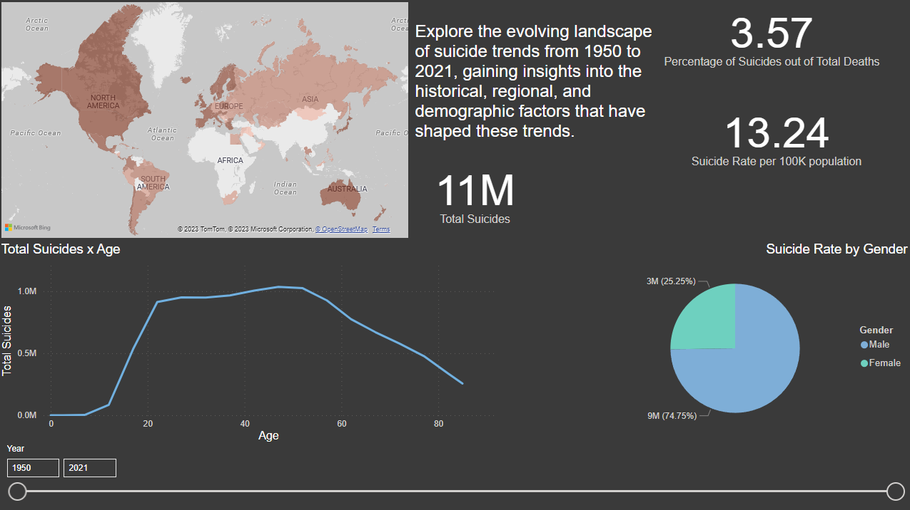

# Data Analysis on Suicide Trends (1950-2021)

This repository presents an insightful analysis of suicide trends spanning from 1950 to 2021. The objective of this study is to uncover historical patterns, demographic influences, and regional variations in suicide rates, fostering a deeper understanding of this critical public health issue.

## Skills and Tools

In pursuit of enhancing my data analysis skills, I embarked on this project using a combination of data analysis libraries and tools. Pandas and Jupyter Notebook were employed for data manipulation and exploration, allowing for a comprehensive examination of the dataset. Additionally, to facilitate data visualization and user-friendly exploration, I created a Power BI Dashboard.

## Dataset

The dataset used for this study was sourced from Kaggle and is publicly accessible [HERE](https://www.kaggle.com/datasets/kumaranand05/who-suicide-data-1950-2021). It encompasses a wide temporal range and provides valuable insights into suicide trends across different regions.

## Analysis and Visualizations

To facilitate data comprehension and exploration, a Power BI Dashboard was developed, offering an interactive platform for viewing, navigating, and filtering information. The dashboard includes visualizations that capture temporal trends, regional disparities, differences by gender and demographic influences.

